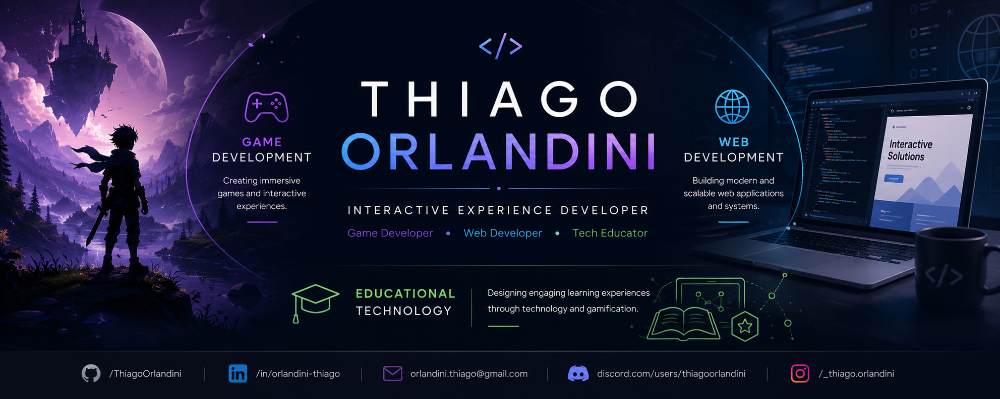

  

<h1 align="center">Thiago Orlandini</h1>

<h3 align="center">Interactive Experience Developer</h3>

Game Development • Web Development • Educational Technology

---

# 👋 About Me

Sou **Desenvolvedor de Jogos, Desenvolvedor Web e Educador Tecnológico**, atuando na interseção entre tecnologia, criatividade e educação.

Minha atuação combina programação, design, narrativa e experiência do usuário para desenvolver aplicações web, jogos digitais e soluções educacionais que unem inovação e aprendizagem significativa.

I’m a **Game Developer, Web Developer and Tech Educator** focused on creating interactive experiences where technology, storytelling and education work together.

### 📌 Quick Info

- 🌎 Based in Brazil
- 🎮 Game Developer & Game Designer
- 🌐 Full Stack Web Developer
- 🎓 Tech Educator
- 🧠 Passionate about Gamification, XR and Interactive Experiences
- 📚 Always learning and building

---

# 🚀 Areas of Expertise

## 🎮 Game Development

Designing immersive experiences through programming, gameplay systems, narrative and level design.

### Main Skills

- Unity
- Gameplay Programming
- Game Design
- Level Design
- Narrative Design

---

## 🌐 Web Development

Developing modern web applications focused on usability, architecture and software quality.

### Main Skills

- Full Stack Development
- PHP
- JavaScript
- HTML & CSS
- MySQL
- PostgreSQL
- Firebase

---

## 🎓 Educational Technology

Building educational experiences through technology, gamification and active learning methodologies.

### Main Skills

- Gamification
- Learning Platforms
- Educational Games
- Active Learning
- Interactive Experiences

---

# 💻 Tech Stack

### Languages

### Front-end

### Databases

### Game Development

### Tools

---

# 🌟 Featured Projects

## 🎮 Where I Belong

Narrative game developed during **Global Game Jam 2019**.

### My Contributions

- Gameplay Programmer
- Game Designer
- Level Designer

### Repository

🔗 https://github.com/ThiagoOrlandini/where-i-belong

---

## 🌐 Featured Web Project

Modern web application focused on usability, software architecture and user experience.

### Technologies

- 

### Repository

🚧 Coming Soon

---

# 🌱 Currently Learning

- Interactive Experience Design
- Unity Advanced Development
- Full Stack Web Development
- Virtual & Augmented Reality
- Gamification
- Educational Technologies

---

# 💡 Philosophy

> Great digital experiences emerge when programming, design and education work together.

Acredito que a tecnologia vai além do código.

Meu objetivo é criar experiências digitais que conectem pessoas ao conhecimento por meio de soluções interativas, acessíveis e significativas.

---

# 🤝 Connect with Me

